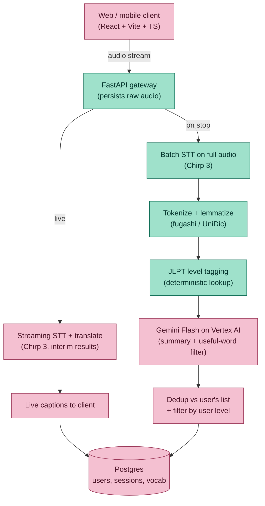
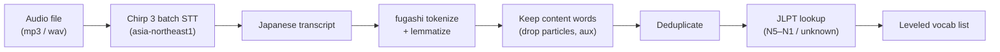

# KikuNote 聞くノート

**Turn real Japanese conversations into a personalized vocabulary list.**

KikuNote records meetings and conversations, transcribes and translates them, and automatically extracts the useful vocabulary — tagged by JLPT level (N5–N1) — so language learners can review the words that actually came up in their day instead of studying generic lists.

It is built for people who work or live in a second language and lose the long tail of words that fly past in real meetings. Built first for Japanese, by someone using it daily.

---

## Why this exists

Generic translation tools (Google Translate, etc.) help you survive a single sentence but throw the learning away the moment the conversation moves on. The words you *didn't* know are exactly the ones worth keeping — and nobody is saving them for you.

KikuNote closes that loop: have the conversation → get a transcript and summary → walk away with a leveled, deduplicated vocabulary list drawn from your own real meetings, ready to review.

---

## Status

This is an actively developed project. The table below is the source of truth for what works today versus what is planned. Nothing here is hidden behind "coming soon" in the code — shipped means runnable.

| Phase | Capability | Status |
|-------|-----------|--------|
| 1 | Audio upload → transcript (Chirp 3, batch) | ✅ Shipped |
| 1 | Vocabulary extraction (fugashi tokenize + lemmatize) | ✅ Shipped |
| 1 | JLPT level tagging (deterministic dictionary lookup) | ✅ Shipped |
| 1 | FastAPI `/process` endpoint (audio in → transcript + vocab out) | ✅ Shipped |
| 1 | Gemini summary + "useful word" filtering (Vertex AI) | 🚧 In progress |
| 1 | React + Vite + TypeScript recorder UI | 🚧 In progress |
| 2 | User accounts + persistent vocabulary list (Postgres) | 📋 Planned |
| 2 | Review interface (spaced-repetition friendly) | 📋 Planned |
| 3 | Live streaming translation (low-latency, single speaker) | 📋 Planned |
| 4 | Containerized deployment to Google Cloud Run | 📋 Planned |
| 4 | Cloud Storage for raw audio + reprocessing | 📋 Planned |

Legend: ✅ shipped · 🚧 in progress · 📋 planned

---

## Target architecture

The full system splits a single audio stream into two independent paths: a **low-latency live path** for real-time translation during a conversation, and a **high-latency batch path** that runs on stop to produce the accurate transcript, summary, and vocabulary list. Both are backed by Postgres.



Green nodes are shipped or partially shipped; pink nodes are planned. (GitHub renders Mermaid natively — this displays as a diagram in the repo.)

### Design principles

- **Two independent paths.** The live path optimizes for latency; the batch path optimizes for accuracy. The batch path always reprocesses the full raw audio — it never inherits the lower-quality live transcript.
- **LLMs only where judgment is required.** Tokenization, lemmatization, and JLPT tagging are deterministic and run locally/by lookup — no model call, no hallucinated levels, no per-token cost. Gemini is used only for summary generation and "is this word worth surfacing" filtering.
- **No orchestration framework.** The pipeline is a linear sequence of direct SDK calls. No LangChain — it adds indirection this workload doesn't need.
- **Raw audio is persisted** so the batch path can reprocess at full quality, independent of whatever the live path produced.

---

## Phase 1 pipeline (shipped today)

What actually runs right now: an audio file goes in, a transcript and a leveled vocabulary list come out.



### Vocabulary extraction, step by step

1. **Tokenize** the transcript with fugashi (Japanese has no spaces between words).
2. **Lemmatize** each token to its dictionary form, so `確認しました` → `確認` and `重要な` → `重要`.
3. **Filter by part of speech** — keep nouns, verbs, adjectives, adverbs; drop particles, auxiliaries, and punctuation.
4. **Deduplicate** — a meeting that says 会議 fifteen times yields it once.
5. **Tag JLPT level** — join each lemma against a JLPT vocabulary table. A miss is marked `unknown`, never guessed.

> **On JLPT data:** official JLPT vocabulary lists do not exist; the community lists everyone uses are reconstructed from pre-2010 official lists and are best-effort, not authoritative. KikuNote treats levels as a useful hint and marks anything outside the table as `unknown` rather than inventing a level.

---

## Tech stack

| Layer | Technology |
|-------|-----------|
| Speech-to-text | Google Cloud Speech-to-Text V2, Chirp 3 (Tokyo region) |
| Summary / filtering | Gemini Flash on Vertex AI |
| Japanese NLP | fugashi + UniDic (tokenization, lemmatization) |
| Backend | Python 3.12, FastAPI, uvicorn |
| Frontend | React + Vite + TypeScript |
| Database | PostgreSQL *(Phase 2)* |
| Packaging / deploy | Docker → Google Cloud Run *(Phase 4)* |
| Cloud | Google Cloud Platform |

---

## Running locally (Phase 1)

The backend (FastAPI, port 8000) and the frontend (Vite dev server, port 5173)
run as **two separate processes**. Start both, then open the Vite URL.

### Prerequisites

- Python 3.12, [uv](https://github.com/astral-sh/uv)
- Node.js 18+ and npm (for the frontend)
- A Google Cloud project with the Speech-to-Text and Vertex AI APIs enabled
- Authenticated Application Default Credentials with access to those APIs
- **[ffmpeg](https://ffmpeg.org/) on your PATH** — required. The backend converts
  every uploaded clip to 16kHz mono WAV with ffmpeg before transcription, because
  Chirp returns empty results on some browser-recorded formats (WebM/Opus, mp4).
  Install via `winget install Gyan.FFmpeg` (Windows), `brew install ffmpeg` (macOS),
  or `apt install ffmpeg` (Debian/Ubuntu), then confirm with `ffmpeg -version`.

### 1. Backend

```bash
cd backend
uv sync
cp .env.example .env   # then fill in your project ID and region
```

`.env`:

```
GOOGLE_CLOUD_PROJECT=your-project-id
STT_REGION=asia-northeast1
```

Run the API:

```bash
uv run uvicorn app.main:app --reload --port 8000
# open http://localhost:8000/docs to try POST /process directly
```

Or run the pipeline standalone on an audio file:

```bash
uv run ./scripts/test_pipeline.py ./recordings/your_audio.mp3
```

### 2. Frontend

In a second terminal:

```bash
cd frontend
npm install
npm run dev
```

Open the printed URL (usually http://localhost:5173) and record. The Vite dev
server proxies `/process` to the backend on :8000, so both servers must be
running. Microphone capture requires a secure context — `localhost` counts, so
local dev works without HTTPS.

---

## Project structure

```
kikunote/
├── backend/
│   ├── app/
│   │   ├── main.py            # FastAPI app + /process endpoint
│   │   ├── pipeline.py        # audio -> transcript + vocab (the core)
│   │   ├── audio/
│   │   │   └── transcribe.py  # Chirp 3 transcription
│   │   └── vocab/
│   │       ├── extract.py     # fugashi tokenize + JLPT lookup
│   │       └── jlpt_vocab.json
│   ├── scripts/               # standalone test runners
│   ├── recordings/            # raw audio (gitignored)
│   └── .env.example
└── frontend/                  # React + Vite + TS (in progress)
```

---

## Roadmap

- **Phase 1 — Record & extract.** Upload audio, get a transcript, summary, and leveled vocabulary list. *(core shipped; summary + UI in progress)*
- **Phase 2 — Save & review.** User accounts; vocabulary persists across sessions; a review interface that surfaces words by level and recency.
- **Phase 3 — Live translation.** Low-latency streaming translation during the conversation, alongside the batch path.
- **Phase 4 — Deploy.** Dockerized, deployed to Cloud Run, with raw audio in Cloud Storage for reprocessing.

---

## License

TBD.